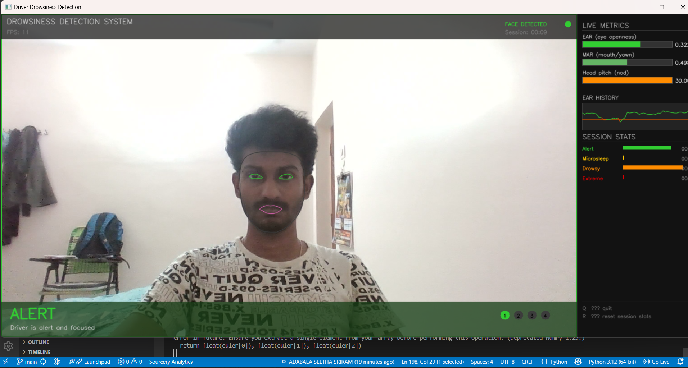
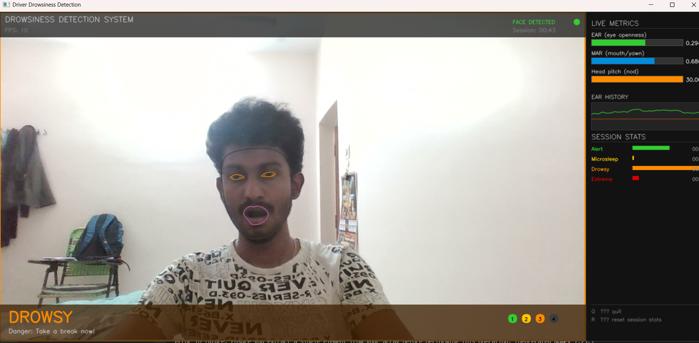
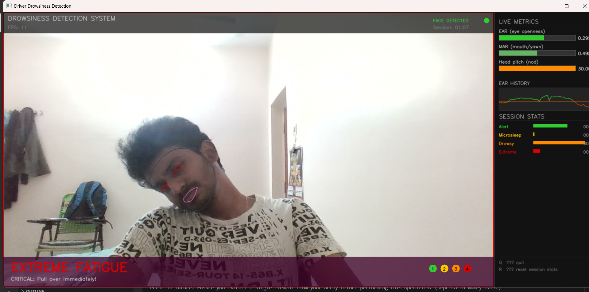

# 🚗 Driver Drowsiness Detection System

Real-time driver drowsiness detection using MediaPipe, OpenCV and Machine Learning.
Detects 4 levels of drowsiness from a live webcam feed with audio alerts.

---

## 📸 Screenshots

| Alert | Drowsy | Extreme Fatigue |
|-------|--------|-----------------|
|  |  |  |

---

## ✅ Features
- Detects 4 drowsiness levels: Alert, Microsleep, Drowsy, Extreme Fatigue
- Live webcam feed with MediaPipe face mesh overlay
- EAR, MAR and Head Pose calculated in real time
- Audio alerts that escalate with drowsiness level
- Session statistics tracked live
- 93% accuracy using Random Forest classifier
- Custom dataset built from scratch using own face

---

## 🛠 Tech Stack
- Python 3.12
- MediaPipe 0.10.x
- OpenCV
- Scikit-learn (Random Forest)
- NumPy, Pandas

---

## 📊 Model Performance

| Model | Accuracy |
|-------|----------|
| Random Forest | 93.00% ✅ |
| Gradient Boosting | 93.00% |
| SVM | 84.75% |

---

## 🚀 How to Run

**1. Clone the repo**